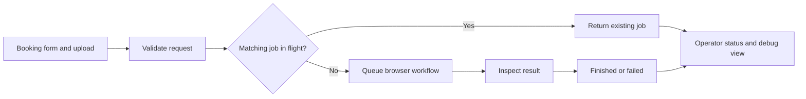

# BookingBot

An internal application that turns repeatable ecommerce booking work into a visible, validated job workflow.

**Workflow automation · Internal tools · Operational handoff** 
**Status:** implemented internal application; public documentation showcase.

[Operating documentation](https://saraward.ai/bookingbot-docs-portfolio.html) · [Workflow and validation](docs/workflow.md) · [Sara Ward](https://saraward.ai)

## The Problem

Booking a rerun sale requires structured input, a line sheet, multiple admin interactions, and a confirmed result. Operators also need to understand what happened when a request is still running or fails validation.

## What I Built

BookingBot wraps browser automation in a purpose-built application. An operator submits a booking request, receives a job identifier, and can inspect progress or failure details. The workflow checks inputs, reuses matching in-flight jobs, and captures evidence for troubleshooting.

## Workflow

Booking form and upload → request validation → duplicate check → browser automation → result inspection → operator review of status or errors.

Submitting a request starts the operation. Status and debug views help the operator distinguish an accepted request from a completed booking.

## My Role

Application and automation development, operational workflow design, deployment packaging, and user documentation. I organized the operating guide around the user journey: getting started, form fields, job states, API behavior, monitoring, and troubleshooting. The linked public documentation sample credits me as its sole author.

## Technology

**JavaScript / Node.js · Playwright · HTTP APIs · file uploads · Docker · AWS container deployment**

The private application includes the booking UI, server, automation, status/debug surfaces, and deployment scripts. This repository contains documentation; it does not install or run the operational application.

## AI vs Deterministic Logic

Booking execution uses conventional code and browser automation. It does not require generative AI. Required-field validation, duplicate detection, job states, and completion checks need predictable behavior. The operator supplies the request and resolves exceptions.

## QA & Human Oversight

| Decision | Practical value |
| --- | --- |
| Validate required input and the uploaded file | Surface missing information before browser execution |
| Return a job ID and explicit state | Make asynchronous work observable |
| Reuse a matching in-flight job | Reduce accidental duplicate requests |
| Inspect the resulting page or success signal | Distinguish an attempted submission from a confirmed result |
| Capture debugging evidence | Help diagnose validation errors and changed page behavior |
| Document the journey and recovery paths | Support people who did not build the tool |

The [validation guide](docs/workflow.md) separates documented behavior from proposed sandbox tests. No live booking or production integration test was run to verify this public showcase. A separate human approval gate after execution is not claimed.

## Architecture

## Outcome

The implemented application brings request intake, browser execution, job visibility, and troubleshooting into one operator workflow. The public operating guide makes that behavior reviewable without access to the internal system. No time-saving, adoption, or revenue metric is claimed here.

## What I Learned

Completion signals, understandable failure states, and recovery instructions are part of the automation product. A successful HTTP response alone is insufficient evidence that the business operation finished.

## Confidentiality

This public case study describes the system architecture and workflow while omitting proprietary source code, credentials, customer data, and internal infrastructure.
