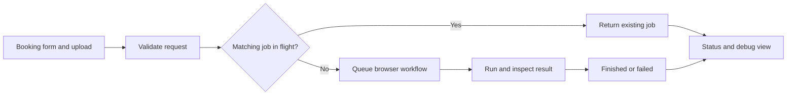

# BookingBot

**Workflow automation · Internal tools · Operational handoff**

An internal application that turns repeatable ecommerce booking work into a visible, validated job workflow.

**My role:** application and automation development, operational workflow design, deployment packaging, and user documentation. The linked public documentation sample credits me as its sole author.

[Read the public documentation sample](https://saraward.ai/bookingbot-docs-portfolio.html) · [Workflow and validation](docs/workflow.md) · [Sara Ward](https://saraward.ai)

## The business problem

Booking a rerun sale requires structured input, a line sheet, multiple admin interactions, and a confirmed result. Operators also need to understand what happened when a request is still running or fails validation.

BookingBot wraps browser automation in a purpose-built application. The user submits a booking request, receives a job identifier, and can inspect progress or failure details.

## The workflow

## Decisions that make it usable

| Decision | Practical value |
| --- | --- |
| Validate required input and the uploaded file | Surface missing information before the browser workflow starts |
| Return a job ID and explicit state | Give the operator a way to follow asynchronous work |
| Reuse a matching in-flight job | Reduce accidental duplicate requests |
| Inspect the resulting page or success signal | Distinguish an attempted submission from a confirmed result |
| Capture debugging evidence | Help diagnose validation errors and changed page behavior |
| Document the user journey and recovery paths | Support people who did not build the tool |

## Technology and scope

**Node.js · Playwright · HTTP APIs · file uploads · Docker · AWS ECS Fargate**

The private application includes the booking UI, server, automation, status/debug surfaces, and deployment scripts. This workflow uses deterministic rules and browser automation; it does not require generative AI to execute a booking.

**Status:** implemented internal application. The public documentation shows the behavior and an anonymized operating guide. This portfolio curation did not execute a live booking or run a production integration test. The [validation guide](docs/workflow.md) separates documented behavior from tests that would require a sandbox.

## The handoff is part of the product

I developed the public documentation sample by reading the existing source and organizing the behavior into a user journey: getting started, form fields, job states, API reference, monitoring, configuration, and troubleshooting.

This project demonstrates operational understanding, application design, browser automation, failure handling, and documentation. Production code, internal records, credentials, and deployment identifiers remain private.
